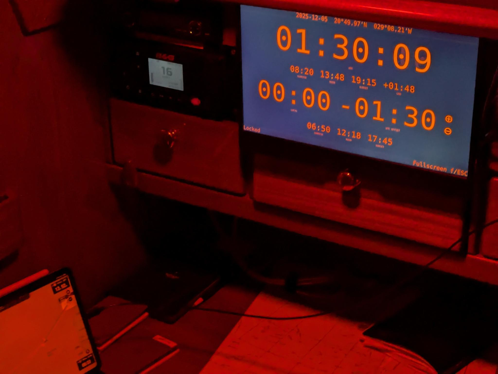
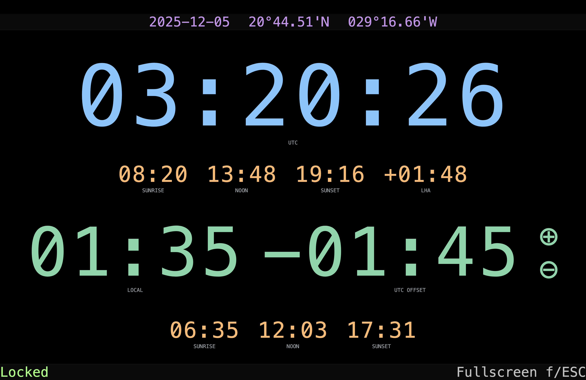
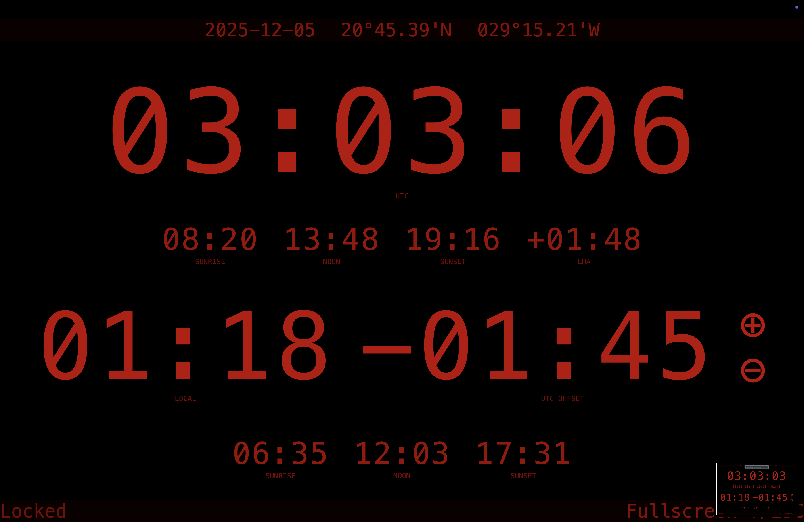

# **Discotime**
*A lightweight boat time dashboard for passagemaking sailors for fluent timezone transitions*

Discotime is a small, self‑contained web app that displays:

- **Current UTC time & date**
- **Local ship's time** with manual UTC offset
- **Sunrise, solar noon, sunset, local hour angle** at your current position
- **Latitude & longitude**
- **Automatic day/night themes**

It is designed for **offline use on sailboats**, especially during long ocean passages where solar times help with watch schedules and navigation routines.

The online version is available here: ➡️ **https://cr.23bit.net/discotime**

For offshore use, serve a **local copy** on your boat’s onboard network.

---

<p align="center">
  
  <br>
  <em>Discotime during nightshift. The midnight shift just started.</em>
</p>

---

## **Features**

- Huge **dashboard display** shows
  - Date and geo coordinates
  - UTC Time with sunrise, solar noon, sunset, local hour angle
  - Local Time with current UTC offset, sunrise, solar noon, sunset
- **Manual UTC offset** *±15 minutes* for Local Time adjustment (`+/-` keys and buttons)
- **Constantly updates solar times** for your current location
- **Fullscreen** mode (`f/Esc` or footer button)
- **Automatic theme switching** at sunset and sunrise
- **Persistent settings** via browser's `localStorage`
- Optional **SignalK** integration
- Designed to work completely **offline**
- Tiny **one-file** deployment

---

## **How we use it**

Time keeping on long passages across time zones is a challenge. One- or even multi-hour clock changes severly disrupt our bodies' natural, sunlight-based rhythm and negatively impact an already exhausting life at sea. With Discotime, we align daily life aboard with the sun while minimizing time change disruptions. You will find that daily 15-minute time changes around noon are practically unnoticeable.

This is how we use it during *SV Blue Disco*'s Atlantic passage: Logbook time aboard is UTC (Reykyavik), and that's what all our boat and personal clocks show as well. (This comes with the added benefit of instantly knowing what time it is back home in UTC+1.) Discotime runs on the big screen at the nav desk for everyone to see in the cockpit and under deck. We left the Canary Islands in late November on UTC+0 local watch time and had solar noon relatively late in the day around 12:53. Within a week we have caught up to the sun and now have solar noon hovering around 12:00 local at UTC-01:30.

Our night watch schedule starts at 20:00 local. The crew set their UTC alarms by adding the local offset of 1.5 hours to their watch times, which is easy enough to do in the head. We now keep our solar noon around 12:00 local by adjusting 15 minutes every day or two as we progress westwards. We always adjust local time around noon when it's least noticeable. This way we will fluently arrive in UTC-4:00 Barbados time without having experienced any disruptive time changes along the way.

---

## **URL Parameters**

Discotime is configurable via URL parameters:

#### **`?day=<theme>`**
#### **`?night=<theme>`**
#### **`?signalk=<host-or-ip:port>`**

### Day and Night Themes

Override day or night theme. Automatic theme switching occurs at sunset and sunrise.

Supported themes:
- **day** (dafault daytime)
- **red** (default night time)
- **dim** (blue reduced)

**Example:**
- `?day=dim&night=dim`

---

<table>
<tr>
  <td align="center">
    <br>
    <strong>day</strong> theme
  </td>
  <td align="center">
    <br>
    <strong>dim</strong> theme
  </td>
  <td align="center">
    <br>
    <strong>red</strong> theme
  </td>
</tr>
</table>

---

### **SignalK Geolocation**

Use a **SignalK server** for geolocation instead of the browser’s geolocation feature. SignalK mode is ideal for boats with NMEA2000/NMEA0183 networks.

**Examples:**
- `?signalk=localhost:3000`
- `?signalk=192.168.178.11:3000`

Discotime uses:
- `/signalk/v1/stream?subscribe=delta`

The SignalK instance must provide:
- `navigation.position` (**required**)

If omitted, Discotime uses the browser’s **own geolocation** feature. 

Encrypted web sockets are not supported at the moment.

**Advantages:**

- Works on laptops, tablets and boat computers without GPS
- Reliable offshore when precise browser geolocation may be unavailable
- Same boat position for all crew devices

---

### **Browser Geolocation**

Without *SignalK* configuration, Discotime uses the browser's built‑in geolocation feature by default. There are some caveats:

- Laptops and tablets without GPS rely on Wi‑Fi and IP-based geolocation – useless at sea
- Default OS settings may prevent or limit geolocation access
- Browser access to **Precise Location** typically is a non-default OS option
- Many browsers require **HTTPS** for precise location – not typically an issue at sea
- If permission is denied or geolocation is unavailable, Discotime displays **“No location (click retry)”**

Check your browser's config with tools like **https://browserleaks.com/geo**.

Discotime uses:
- `navigator.geolocation.getCurrentPosition()`  
- `navigator.geolocation.watchPosition()`

Settings used:
- `enableHighAccuracy: true`
- `timeout: 30000`
- `maximumAge: 60000`

---

## **Running Locally (recommended offshore)**

For ocean crossings, serve Discotime **locally**.

Save a copy of [`build/index.html`](build/index.html) or the minified [`build/index.min.html`](build/index.min.html) as *index.html* in a suitable directory of your boat's web server. No special server features are required.

If you have python installed, you can start a minimal web server with:

```sh
python3 -m http.server
```

Then open in a browser:

```
http://localhost:8000/
```

Or using the SignalK backend at *localhost:3000*:

```
http://localhost:8000/?signalk=localhost:3000
```

**Benefits:**

- Fully offline
- Accessible by all crew devices
- Works on Raspberry Pi, laptops, nav computers
- Zero dependencies beyond Python and a browser

---

## License

This project is licensed under the **GNU General Public License v3.0 (GPL-3.0)**.

You are free to:

- Use the software for any purpose
- Study how it works
- Modify it to fit your needs
- Redistribute the original or modified versions

…as long as any distributed versions remain licensed under GPL-3.0 and the source code is made available.

For the full license text, see the [`LICENSE`](LICENSE) file or visit https://www.gnu.org/licenses/gpl-3.0.txt.